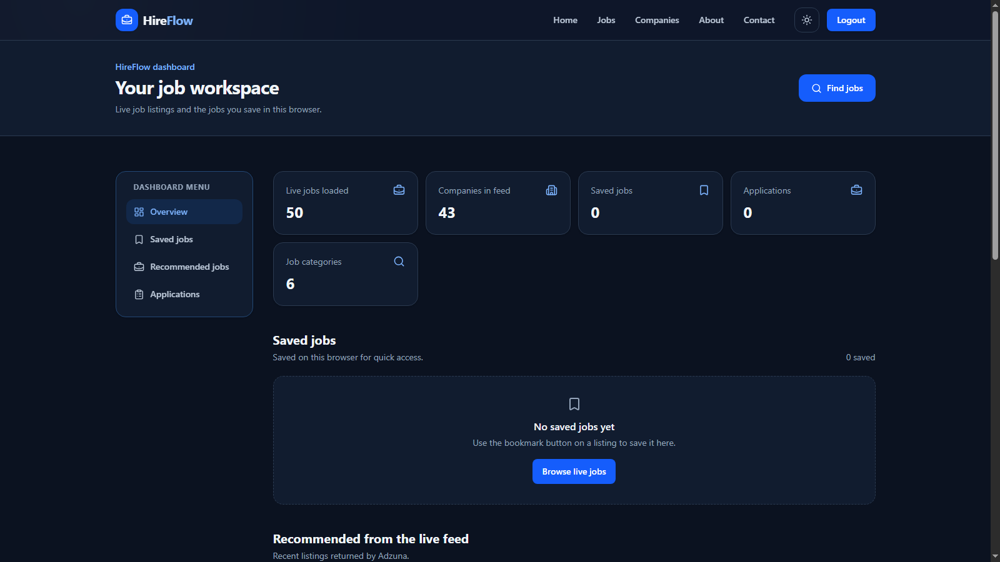
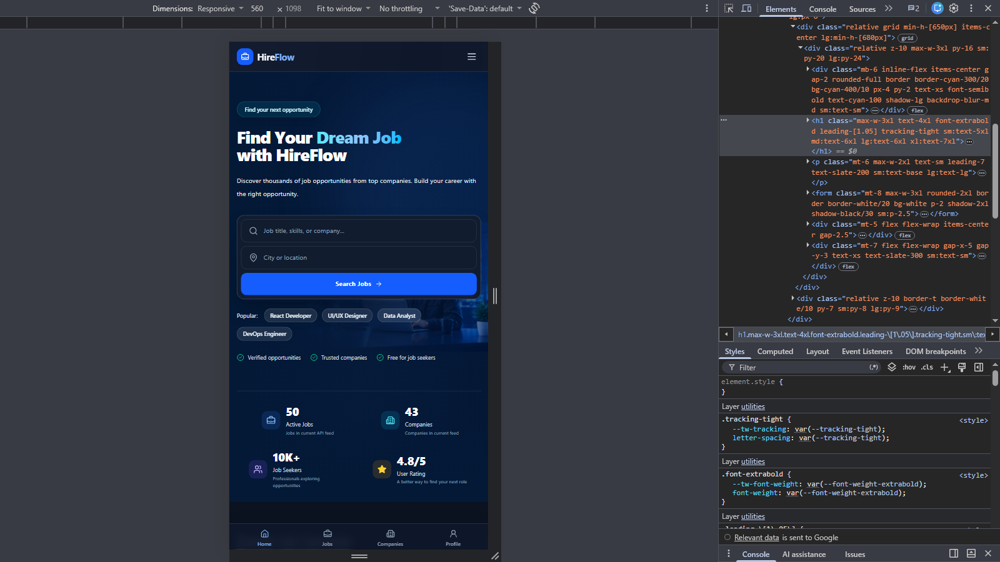

# HireFlow Job Hub

HireFlow Job Hub is a modern, fully responsive job discovery web application built with React, Tailwind CSS, and the Adzuna Jobs API. It provides an interactive platform for exploring job opportunities, discovering companies, saving jobs, and tracking job applications through a clean, user-friendly interface.

## Live Demo

[View HireFlow Job Hub](https://hireflow-job-hub.vercel.app)

## 📸 Screenshots

### Home Page

### Job Filter & Listing

### Dashboard UI

### Responsive Design

## Features

- Fully responsive job portal UI for desktop, tablet, and mobile
- User Authentication UI with Login and Sign Up
- Live job search with keyword and location filters
- Job filtering by category, job type, experience level, and salary
- Company discovery and browsing
- Save and manage favorite job opportunities
- Dashboard for managing saved jobs and applications
- Application preparation and tracking
- Client-side account access with role-aware UI
- Light and dark theme support
- Local browser storage for user preferences, saved jobs, and application data

## Tech Stack

- React
- React Router
- Vite
- Tailwind CSS
- Adzuna Jobs API
- LocalStorage

Project Structure

hireflow-job-hub/
├── api/
│   └── adzuna/
│       └── [...path].js
├── public/
├── src/
│   ├── assets/
│   │   └── screenshots/
│   ├── components/
│   │   ├── common/
│   │   ├── companies/
│   │   ├── dashboard/
│   │   ├── home/
│   │   ├── jobs/
│   │   └── layout/
│   ├── context/
│   │   ├── theme/
│   │   └── toast/
│   ├── layouts/
│   ├── pages/
│   ├── routes/
│   ├── services/
│   ├── App.jsx
│   ├── index.css
│   └── main.jsx
├── index.html
├── package.json
├── vite.config.js
├── vercel.json
└── README.md

Local Development

1. Clone the repository:

git clone https://github.com/syedfurqanullah/hireflow-job-hub.git
cd hireflow-job-hub

2. Install dependencies:

npm install

3. Start the development server:

npm run dev

4. Open the local URL shown in your terminal.

## Notes

HireFlow Job Hub is a frontend-focused project built to strengthen my skills in React, API integration, responsive UI development, state management, and interactive user experiences.

User accounts, saved jobs, applications, and preferences are stored locally in the browser. The project does not currently use a backend database or server-side authentication.

## Author

- **Portfolio:** [Syed Furqan Ullah](https://syed-furqan-ullah-portfolio.netlify.app/)
- **GitHub:** [@syedfurqanullah](https://github.com/syedfurqanullah)
- **LinkedIn:** [Syed Furqan Ullah](https://www.linkedin.com/in/syed-furqan-ullah/)
